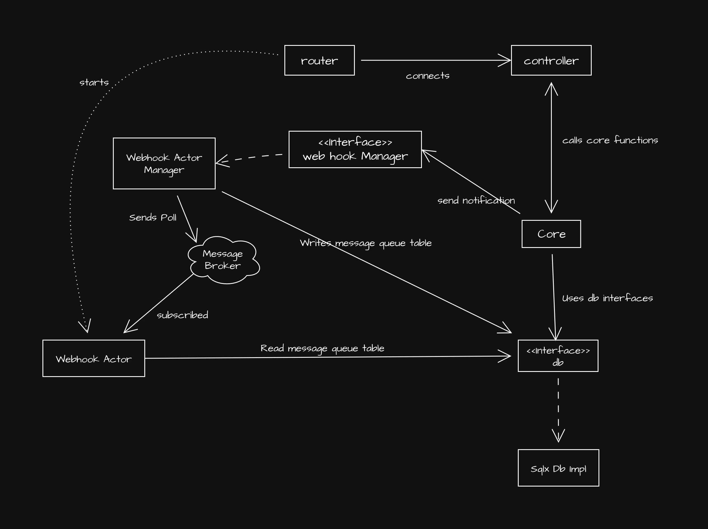

# Design Documentation

I am not sure how to make this documentation and I am typing it with hand. So please forgive me if I don't know the actual format of doing it.

## Structure of project

```
 .
├──  API-Documentation.md --> API Documentation
├──  Cargo.lock
├──  Cargo.toml
├──  DESIGN.md
├──  docker-compose.yml
├──  Dockerfile
├──  migrations --> It contains migrations
│ ├──  20250919063118_api_keys.down.sql
├── 󱧼 src
│ ├──  actor_webhook_service_impl --> This contains sqlx implementation for `webhook_service`
│ ├──  bin --> contains binaries. `server` is one which have server
│ ├──  controller --> It contains controllers
│ ├──  core --> This contains actual logics (Independent of `controller`)
│ ├──  db --> Interface for database(independent of `sqlx`)
│ ├──  errors.rs --> errors :)
│ ├──  lib.rs --> exports everything to main
│ ├──  messages --> Massages to be shared through `controller` to `core`
│ ├──  router.rs --> Starting point for the server
│ ├──  sqlx_db_impl --> This contains sqlx implementation for `db`
│ ├──  validator.rs --> Validates keys
│ └──  webhook_service --> Interface for webhook(Independent of `actor_webhook_service_impl`)
├──  target
└──  webhook-server.js
```

## I have tried to use lessons from clean architecuture



So there is over all internal architecure I have tried my best to design it in a way so we can plug better infrastructure in future.

For example look at sqlx, we may want something else? replace it! Or the webhook actor. We should create completely seperate service with a good queue like rabbitMQ.

I have used clean architecture. Few thing to note are that Infrastructure is kept seperate from actual business logic as we might change infrastructure later. Tesing of business logic can be done using demo infrastructure as we have interface for infrastructure. Even the business logic is tried to keep loosly coupled with Actix_web, I am not sure when it might not work and we re build controllers.

For Webhook I have utilized actors provided my actix. I did spin a actor which waits for poll lazily and if there is poll from broker. I does pull latest messages in queue and sends all.

Rate limit is achieved using in memory hashmap and middleware. It is very effective. There is a bash file to test it too. 

## Atomic Transactions

I am utilizing mysql's transaction and lock to achieve true atomic transactions. But here is all the thoughts givento it!

So when I got the problem statement. I stumble the word atomic. As a computer science student it have a lots of thinking to be given. First of I had read that the SQL db follows ACID, where `A` is for Atomic.

But then how do I know if it really is atomic.

So what is atomic? The question is very easy to answer. If a set of of operation can roll back without affecting the actual system in case of failure at any step, we can call it an atomic operation. Easy?

NO!

The main problem is concurrency. First of all I though maybe the question want me to develop an atomic design using those popular design patters. Have state refered as momento and storing them and in case of failure rolling back!

But after struggling bit! I understood that not easy to do.

Let me explain!

So to make any system atomic we need to do following.

1. Begin a transaction. That is like making a new branch in git.

2. Lock all the resource one by one (Why? So no one makes a bad decision based on race), as an analogy imagine if you are working on a file in you branch and someone really edit it in main. It will make merge conflict

3. Modify everything

4. and commit all

5. release locks

If anything is worng till step 3 then noting bad can happen

but what if one of the commit fails?

Thats a problem. now you can't rollback the commited data.

I was trying to find solution to it. But then I didn't find anything reliable. But I got to know that people depend on database for such situation.

If i have to modify only one database then I can use mysql transactions with locks.

**Tradeoffs**

Making atomic transactions with psql locks and transaction has benefit of being corret always. But it does lock row for some time. This me result in delay for others accessing the row data such as balance.

There are more passive approaches such as adding a column and passively checking if someone has change the value in that column. But it does have chances of breaking. What if two users check row at same time and sends lock request? Also in case of failure to aquire we have to handle situation ourselves.

## Idempotency

I have implemented Idempotency using `Idempotency-Key`. This was a little tricky task because of Actix-Web. Cloning Service Response is not easy. I had to make way to rebuild it. Kind of hacky way!

For now if you wan you can add Idempotency-Key in header and it will work. For each request `Idempotency-Key`must be unique. King uneasy. But better use uuid in production system. I saw this approach in strip's documentation https://docs.stripe.com/api/idempotent_requests

**Trade offs**

As always there have to be some trade off. Here I have used postgress table to cache request :) Not a good idea! Its slow, something like inmemeory database should have been used.

Also rebuilding whole response? Who does that? I didn't had option!

## Webhook

Webhook works by a actor running in background and sending all the messages. The actor gets poll through actix broker. I have used a table in postgres as message queue. yes! thats it!
Yes! Kafka or rabbitMQ with Postgress would have been a better setup as per scalability is concerened.

**Trade off**

Using table as queue is slow also actor and broker setup is not future proof.

## Rate Limiting

So the rate limit was supposed to be applied on requests made by api key. I have used an in-memory HashMap. The key is api-key and value is tuple is count and timestamp of first request. I am matching the timestamp lapse for the count. Based on the condition I decide if I have to refuse, increment count or reset count. This is very effective. 

## Things I could have had improved

I should have used AI more to do the repetative tasks. I was tring to structure very thing and reason round. My goal was to give lots of space to upgrade.

I should have had used workspace as that could have help me make a better seperation between modules which are independent such as `core`, `actor_webhook_service_impl` and`sqlx_db_impl`.

Also i would have got chance to combine common things
